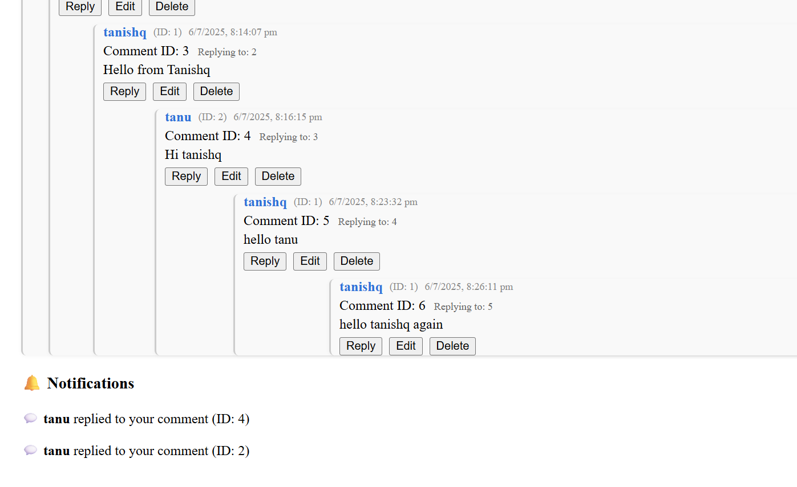
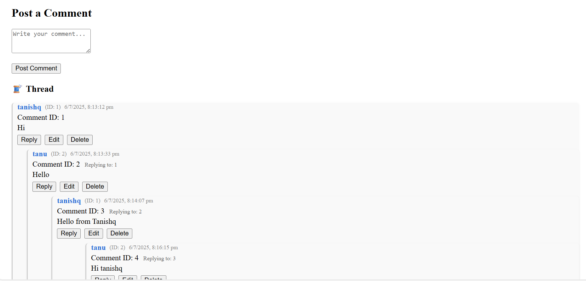

# Comment App

A full-stack comment application with authentication, threaded/nested comments, notifications, and moderation features. Built with NestJS (backend) and React (frontend).

---

## Features

- User registration and login (JWT-based authentication)
- Post, reply, edit, soft-delete, and restore comments
- Fully nested/threaded comments (replies to replies, unlimited depth)
- Real-time notifications when someone replies to your comment
- Responsive, modern React frontend
- PostgreSQL database (via TypeORM)
- Dockerized for easy setup

---

## Project Structure

```
comment-app/
├── comment-backend/      # NestJS backend
│   ├── src/
│   │   ├── auth/         # Auth logic (JWT, guards, user entity)
│   │   ├── comments/     # Comment logic (threading, moderation)
│   │   ├── notifications/# Notification logic (event-driven)
│   │   └── ...
│   ├── .env              # Environment variables
│   ├── Dockerfile
│   └── ...
├── comment-frontend/     # React frontend
│   ├── src/
│   │   └── App.jsx       # Main React app
│   ├── index.html
│   └── ...
├── docker-compose.yml    # Multi-service orchestration
└── README.md             # This file
```

---

## Getting Started

### Prerequisites
- [Docker](https://www.docker.com/) (recommended)
- Or: Node.js (v18+), npm, and PostgreSQL if running locally

### 1. Clone the repository
```sh
git clone https://github.com/yourusername/comment-app.git
cd comment-app
```

### 2. Environment Variables
Edit `comment-backend/.env`:
```
DATABASE_URL=postgres://postgres:yourpassword@db:5432/comments
JWT_SECRET=your_jwt_secret_here
```

### 3. Run with Docker (Recommended)
```sh
docker-compose up --build
```
- Backend: http://localhost:3000
- Frontend: http://localhost:5173 (or as configured)

### 4. Run Locally (Manual)
#### Backend
```sh
cd comment-backend
npm install
npm run start:dev
```
#### Frontend
```sh
cd comment-frontend
npm install
npm start
```

---

## API Endpoints

### Auth
- `POST /auth/register` — Register a new user `{ username, password }`
- `POST /auth/login` — Login and receive JWT `{ username, password }`

### Comments
- `GET /comments` — Get all root comments (with nested replies)
- `GET /comments/:id/replies` — Get replies to a comment
- `POST /comments` — Post a comment or reply `{ content, parentId? }` (JWT required)
- `PUT /comments/:id` — Edit a comment (JWT required, only within 15 minutes)
- `DELETE /comments/:id` — Soft-delete a comment (JWT required)
- `PATCH /comments/:id/restore` — Restore a deleted comment (JWT required, within 15 minutes)

### Notifications
- `GET /notifications/:userId` — Get notifications for a user (JWT required)
- `PATCH /notifications/:id/read` — Mark notification as read
- `PATCH /notifications/:id/unread` — Mark notification as unread

---

## Frontend Usage

- Register or login to get started
- Post comments or replies (threaded)
- Edit or delete your own comments (within 15 minutes)
- Restore deleted comments (within 15 minutes)
- View notifications when someone replies to your comment
- Responsive UI for desktop and mobile

---

## Technologies Used
- **Backend:** NestJS, TypeORM, PostgreSQL, JWT, Docker
- **Frontend:** React, Fetch API, CSS
- **Other:** EventEmitter (for notifications), Docker Compose

---

## Customization & Extending
- Add more notification types (likes, mentions, etc.)
- Add user profiles or avatars
- Add rate limiting, spam protection, or moderation tools
- Integrate with a real-time system (WebSockets) for live updates

---

## Author
- [Tanishq Nigam](https://github.com/C1earNote)

---

## Screenshots


